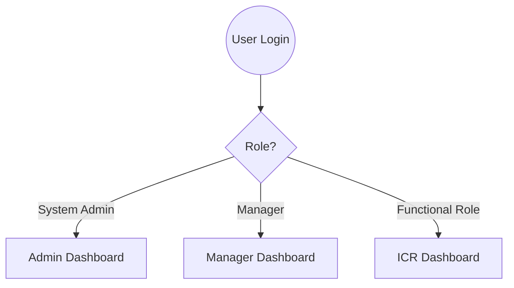
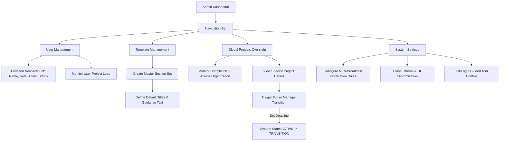
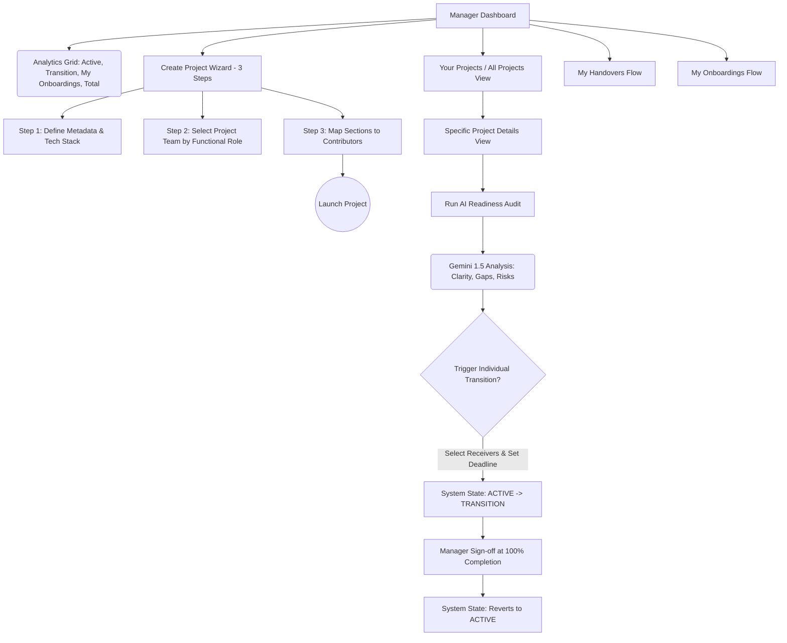
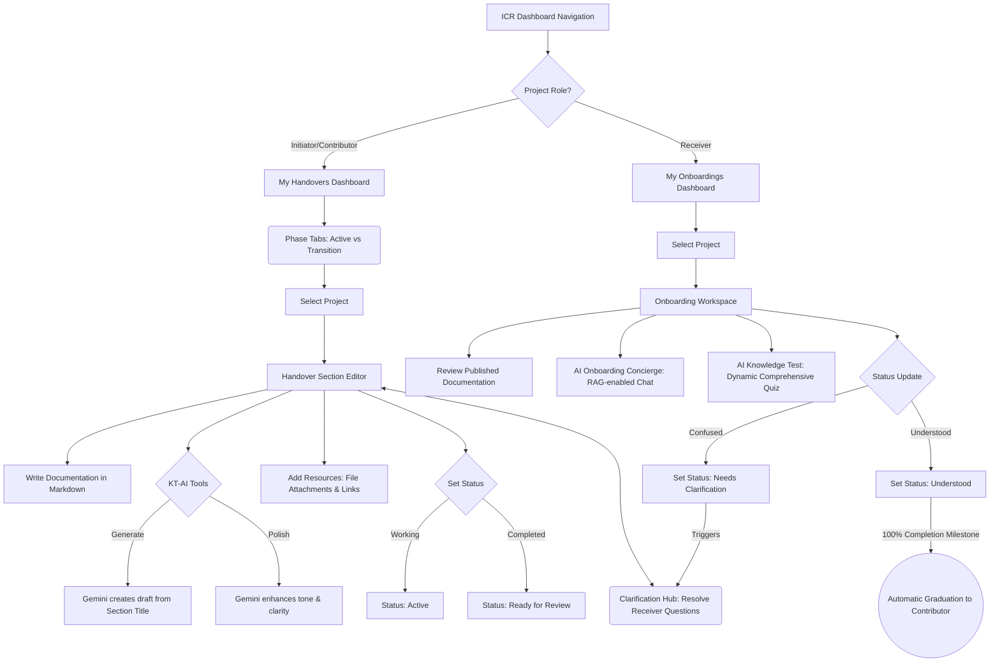

# Knowledge Transfer Management System - Current System Specification

This document provides a definitive map of the application's current working condition, logic, and module-specific user flows.

## 1. Authentication & Role-Based Entry
Upon login, the system evaluates the user's role and redirects them via the `DashboardRedirect` component to their designated module.

---

## 2. Admin Module - System Orchestration Flow
The Admin module manages the global infrastructure, user lifecycle, and organizational documentation standards.

---

## 3. Manager Module - Portfolio Management Flow
The Manager module focuses on launching knowledge transfers, monitoring team velocity, and ensuring quality through AI auditing.

---

## 4. ICR Module - Unified Flow (Contributor & Receiver)
The ICR module supports both knowledge capture (handovers) and absorption (onboardings), enabling a seamless transition of information through AI-assisted documentation and interactive learning.

---

## 5. Technical State & Lifecycle Logic
*   **Continuous Phases**: Projects oscillate between **ACTIVE** (drafting) and **TRANSITION** (reading) modes organically.
*   **Transition Governance & Triggers**:
    *   **Individual Transitions**: Triggered by **Managers** for specific team members. Requires setting a target handover deadline.
    *   **Full / Manager Transitions**: Triggered exclusively by **System Admins** when rotating project ownership or doing a global handover. Requires a target deadline.
*   **Transition Reversion (Sign Off)**: Once a transition phase (Individual, Full, or Manager) reaches 100% completion by Receivers, the Manager signs off on the transition, reverting the system state back to the **ACTIVE** baseline phase.
*   **The Clarification Loop**: Mandatory resolution path for any section flagged with questions by a Receiver.
*   **The Graduation Event**: When a Receiver reaches full comprehension (100% completion in TRANSITION mode), the system automatically promotes their role to **Contributor** for that project.
*   **Real-time Synchronization**: All state changes are broadcast across modules instantly via Supabase channels.
