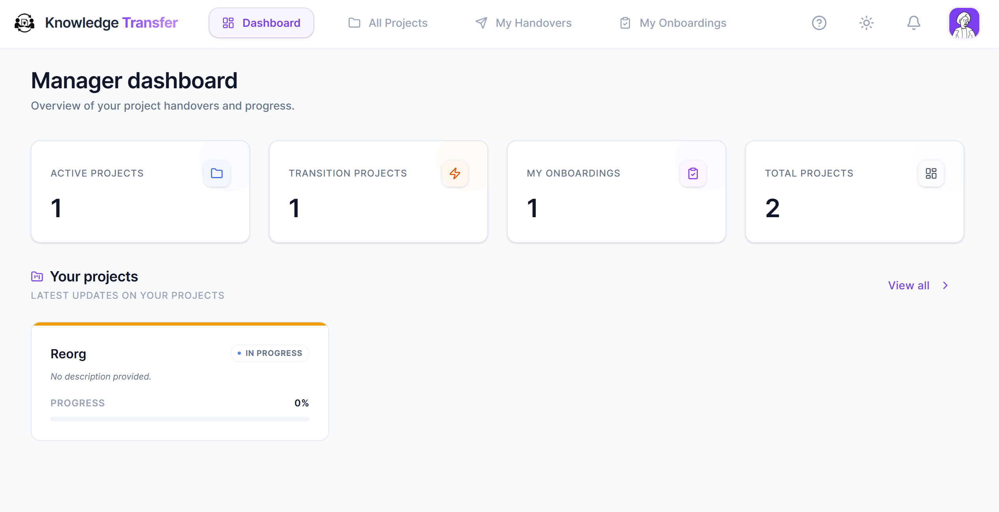

 
# 🧠 Project Knowledge Transfer and Handover Management System
 
**Capture. Hand over. Validate. Sign off.**
A role-based web platform that makes sure project knowledge never leaves with the person.
 

 

 

 
---
 
## 📖 About
When people leave a project, their knowledge usually leaves with them. The **Project Knowledge Transfer (KT) Portal** structures that hand-over: managers define the work, contributors document it section by section, receivers study it and **prove their understanding** through AI-generated quizzes, and managers sign the transition off with a measurable readiness score.
 
## ✨ Features
| | Feature | Description |
|---|---|---|
| 👥 | **Role-based portals** | Separate experiences for System Admins, Managers and team members (Initiator / Contributor / Receiver). |
| 🗂️ | **Section templates** | Admins define standard documentation sections that managers reuse. |
| 🔄 | **Project lifecycle** | Switch projects between *Active* and *Transition* (Individual, Full, Partial, Manager hand-over). |
| ✍️ | **Markdown editor** | Toolbar, table designer, undo/redo, smart paste, attachments and links. |
| 🤖 | **Gemini AI** | Draft & polish, clarity scoring, tech-stack extraction, readiness audit, quizzes and an onboarding concierge chatbot. |
| 📈 | **Live progress** | Per-receiver progress and project completion with real-time sync. |
| 🔔 | **Notifications** | In-app inbox per user and module, powered by Supabase Realtime. |
| 🧭 | **Guided tour** | Role-specific walkthrough for first-time users. |
| 📄 | **PDF reports** | One-click project hand-over report. |
| 🎨 | **Live theming** | Brand colour, radius and sidebar customisable by admins; light/dark mode. |
 
## 🔁 How it works
1. **Admin** creates users and section templates.
2. **Manager** creates a project, assigns the team and maps sections to contributors.
3. **Contributors** write documentation and press *Submit*.
4. **Transition starts** – documentation becomes read-only; receivers are assigned.
5. **Receivers** read, ask for clarification, and pass the AI quiz to mark sections *Understood*.
6. **Sign-off** – the project returns to *Active*, receivers graduate to contributors.
 
## 🧰 Tech Stack
| Layer | Technology |
|---|---|
| Frontend | React 19, Vite 7, React Router 7 |
| Styling | Tailwind CSS 3, shadcn/ui, Radix UI, class-variance-authority, Lucide icons |
| Backend (BaaS) | Supabase – PostgreSQL, Auth, Realtime, Edge Functions (Deno) |
| AI | Google Gemini (@google/generative-ai) |
| Content | react-markdown, remark-gfm, remark-breaks, rehype-raw |
| UX | react-joyride, sonner |
| Reporting | jsPDF, jspdf-autotable |
| Quality | ESLint 9, TypeScript, Vitest |
 
## 🏗️ Architecture
~~~mermaid
flowchart LR
  UI[React SPA] -->|supabase-js| DB[(Supabase Postgres)]
  UI -->|Realtime WebSocket| DB
  UI -->|Auth| AUTH[Supabase Auth]
  UI -->|invoke| EDGE[Edge Function: manage-user]
  EDGE -->|service role| AUTH
  EDGE --> DB
  UI -->|generateContent| GEM[Google Gemini]
~~~
 
State is handled by React Context providers: **Auth → Theme → Admin → Project → Notification**.
 
## 🚀 Getting Started
### Prerequisites
- Node.js **20.19+** and npm
- A [Supabase](https://supabase.com) project
- A [Google AI Studio](https://aistudio.google.com) API key
- [Supabase CLI](https://supabase.com/docs/guides/cli) (for the Edge Function)
 
### Installation
~~~bash
git clone https://github.com/your-username/ktproject.git
cd ktproject
npm install
cp .env.example .env      # then fill in the values
npm run dev               # http://localhost:5174
~~~
 
### Database
Create the tables listed in [docs/schema.md](docs/schema.md) (users, templates, system_settings, projects, project_members, project_sections, section_attachments, section_comments, section_links, receiver_section_progress, project_transitions, notifications), add a trigger that inserts a row into `public.users` when an auth user is created, insert the single `system_settings` row (id = 1) and enable Row Level Security.
 
### Edge Function
~~~bash
supabase login
supabase link --project-ref <your-project-ref>
supabase functions deploy manage-user
~~~
 
### First admin
Create the first user in the Supabase dashboard, then set `role = 'System Admin'` on its row in `public.users`.
 
## 🔐 Environment Variables
| Variable | Required | Description |
|---|---|---|
| `VITE_SUPABASE_URL` | ✅ | Supabase project URL |
| `VITE_SUPABASE_ANON_KEY` | ✅ | Supabase public anon key |
| `VITE_GEMINI_API_KEY` | ⚠️ | Enables AI features (use a server proxy in production) |
 
Edge Function secrets (`SUPABASE_URL`, `SUPABASE_SERVICE_ROLE_KEY`) are injected by Supabase – **never** expose the service-role key in the frontend.
 
## 📜 Scripts
| Command | Description |
|---|---|
| `npm run dev` | Start the dev server on port 5174 |
| `npm run build` | Production build to `dist/` |
| `npm run preview` | Preview the production build |
| `npm run lint` | Run ESLint |
 
## 🗂️ Project Structure
~~~text
src/
├── components/      # layouts, tour, AI widgets, ui/ (shadcn)
├── contexts/        # Auth, Theme, Admin, Project, Notification
├── lib/             # supabase client, utils, pdfExport
├── pages/           # admin/, manager/, icr/ + shared pages
├── services/        # aiService (Gemini)
└── App.jsx          # providers & routes
supabase/functions/manage-user/   # Edge Function (Deno)
~~~
 
## 👤 Roles & Permissions
| Role | Can do |
|---|---|
| **System Admin** | Manage users, templates, settings; view all projects; start full transitions; export, archive, delete. |
| **Manager** | Create projects, manage team and sections, start individual transitions, run AI audits, sign off. |
| **Initiator** | Owner of knowledge being handed over; documents sections. |
| **Contributor** | Writes and submits assigned sections. |
| **Receiver** | Reads, requests clarification, takes quizzes, completes the transition. |
 
## 🛡️ Security
- Sessions are stored in `sessionStorage` and end when the tab closes.
- Enable **Row Level Security** on all tables; client-side route guards are UX, not security.
- Keep the Gemini key server-side in production and sanitise rendered Markdown.
 
## 🤝 Contributing
1. Fork the repo and create a branch: `git checkout -b feature/amazing-feature`
2. Commit with a clear message: `git commit -m "feat: add amazing feature"`
3. Push and open a Pull Request.
 

Built with ❤️ using React, Supabase and Gemini

